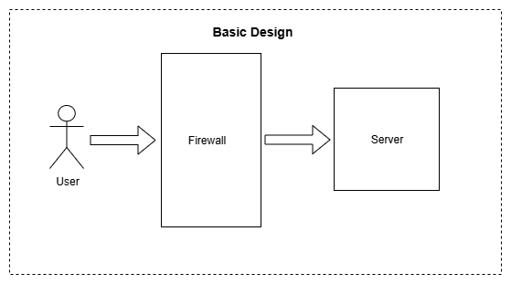
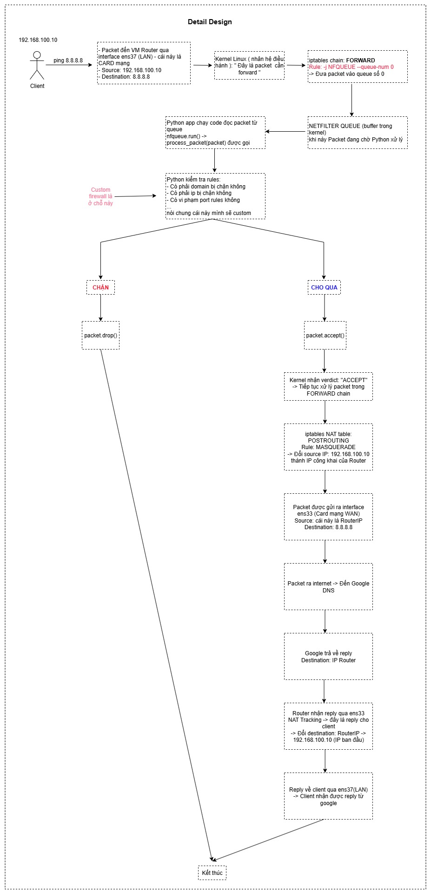

# Custom Firewall with Rule Engine

## Giới thiệu

Project này xây dựng một **custome firewall** có khả năng lọc gói tin theo **rule engine**. Firewall được triển khai ở mức packet-level, sử dụng thư viện **Python (netfilterqueue)** để tương tác trực tiếp với hệ thống. Các rule được định trong **rules.json**, giúp tách biệt logic xử lý và tập luật, từ đó dễ dàng mở rộng và tùy chỉnh

## Triển khai

- OS: Ubuntu
- Firewall được triển khai thông qua sự kết hợp giữa **iptables** và **Python (netfilterqueue)**
- Người dùng có thể chỉnh sửa file `rules.json` để thay đổi luật lọc mà không cần sửa code Python

## Tính năng

- Block theo Port, domain, flag,...: cho phép hoặc chặn gói tin dựa trên nhiều tiêu chí
- Time-based Rules: lọc gói tin theo khung giờ
- Rate Limiting: Giới hạn số lượng request trong một khoảng thời gian
- Geo-blocking: chặn hoặc cho phép truy cập theo quốc gia
- Advanced Logging: ghi log chi tiết các sự kiện liên quan đến packet filtering
- Deep Packet Inspection: kiểm tra nội dung gói tin ở mức sâu hơn
- Whitelist/Blacklist Management: quản lý danh sách cho phép và chặn
- Caching: lưu tạm kết quả xử lý để tăng hiệu năng
- Load Balacing: phân phối tải khi có nhiều kết nối song song

## Công nghệ sử dụng

- Python với thư viện netfilterqueue
- iptables để điều hướng gói tin đến firewall
- rules.json để định nghĩa luật lọc

## Thành viên

- Trịnh Quang Lâm
- Vũ Nhân Kiên
- Cao Thị Thu Hương

## Tổng quan

### Basic Design

  

### Detail Design

  

